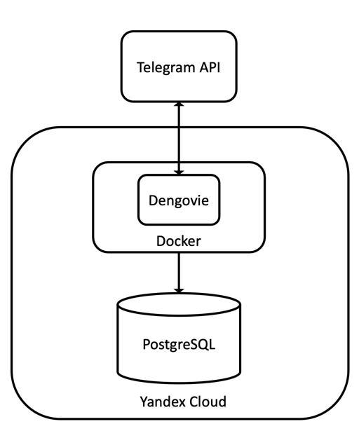
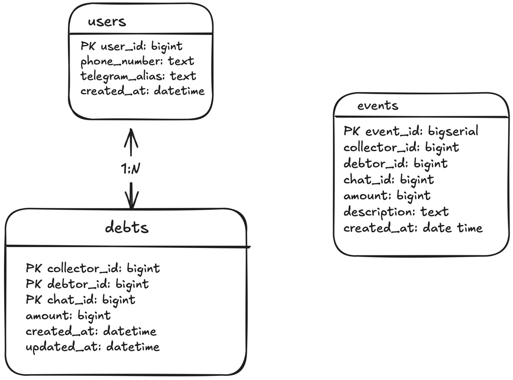

# Телеграм бот "Деньговье"
Удобный помощник для учета долгов в telegram.

# Как воспользоваться?
- В telegram найдите [@debtevation_bot](https://t.me/debtevation_bot) и добавьте его в группу
- Зарегистрируйся в личных сообщениях с ботом

# Команды 
- `/register` - зарегистрироваться в боте
- `/list` - посмотреть список долгов
- `/split <amount> <description>` - поделить долг между пользователями
- `/return` - вернуть долг пользователю
- `/optimize` - оптимизировать долги (уменьшить количество транзакций)

# Верхнеуровневая архитектура

# Схема базы данных
Миграции можно найти [здесь](https://github.com/art22m/dengovie/tree/master/internal/pkg/store/migrations).

# Ссылки
Страничка проекта на wiki [[link]](https://cs-uni.ru/index.php?title=DDF24_Деньговье)

